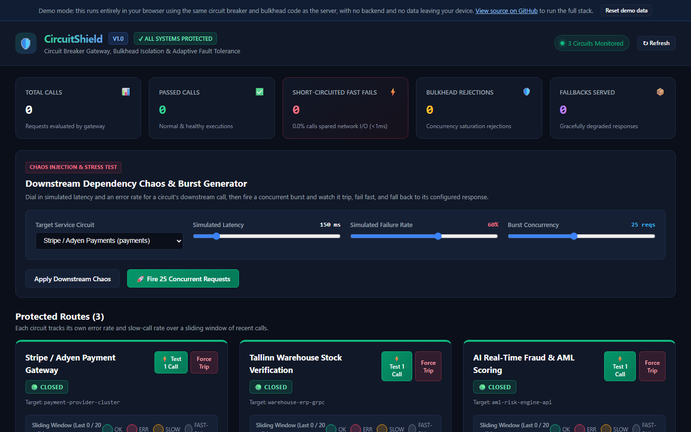
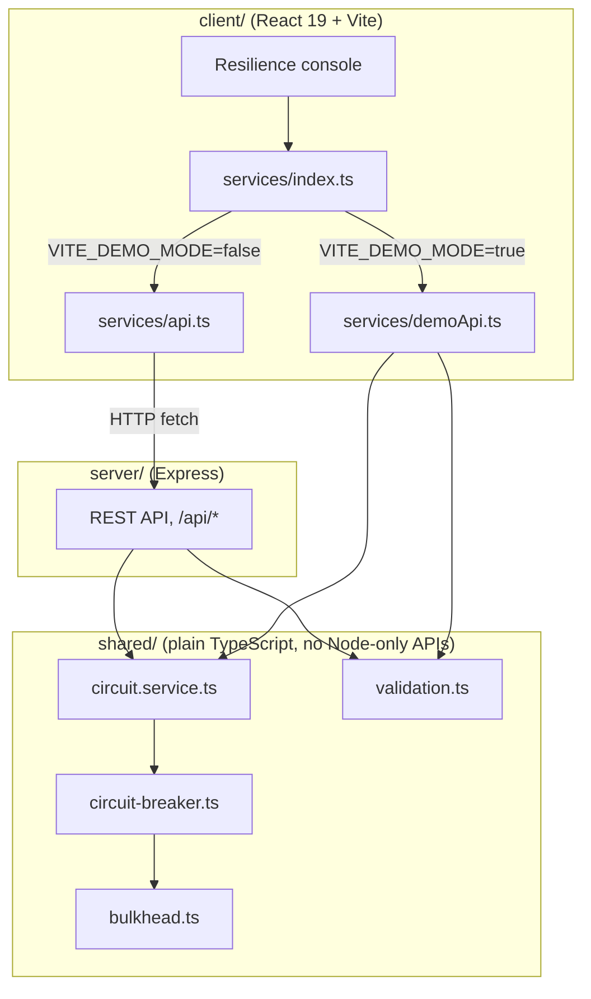

# CircuitShield

CircuitShield is a circuit breaker and bulkhead isolation gateway: an Express API that protects a downstream
call behind a three-state breaker (`CLOSED` / `OPEN` / `HALF_OPEN`) and a per-route concurrency limiter, plus a
React console for watching the breaker trip, cool down and heal in real time. It ships with three example
routes (Payments, Inventory, Fraud) whose "downstream" is an in-process function that simulates latency and
error rates, so you can dial in a failure scenario and watch the breaker react without wiring up real services.

[](https://github.com/Taan1el/circuitshield/actions/workflows/ci.yml)
[](https://github.com/Taan1el/circuitshield/actions/workflows/pages.yml)
[](LICENSE)

**Live demo:** https://taan1el.github.io/circuitshield/

The demo runs entirely in your browser: the same circuit breaker, bulkhead and service code the server uses
runs against simulated in-process calls instead of a real API, so it works with no backend.

## Screenshot



More screenshots: [chaos and burst generator](docs/screenshots/02-chaos-simulator.png), [a tripped circuit cooling down](docs/screenshots/03-circuit-tripped.png).

## Features

- **Three-state circuit breaker** (`CLOSED` → `OPEN` → `HALF_OPEN`) per route, with a configurable failure-rate
  threshold, slow-call threshold, and cooldown before the next trial probe.
- **Bounded sliding-window failure detector**: the last `slidingWindowSize` call outcomes (default 20) decide
  whether the failure rate or slow-call rate has breached its threshold, so a stale incident from hours ago
  cannot keep a circuit tripped.
- **Bulkhead concurrency isolation**: each circuit gets its own concurrency quota and a bounded FIFO wait
  queue, so a slow route cannot starve the others sharing the same process.
- **Configurable fallback payloads**: a tripped or bulkhead-rejected call returns the route's pre-configured
  degraded response (e.g. "payment queued for offline reconciliation") instead of an error page.
- **Chaos and burst generator**: dial in simulated downstream latency and error rate, then fire a burst of
  concurrent requests and watch the breaker trip, fail fast, and recover.
- **Live telemetry**: total calls, passed calls, fast-fails, bulkhead rejections and fallbacks served, refreshed
  every 2 seconds.
- **GitHub Pages demo mode**: no backend required; the browser build runs the exact same breaker, bulkhead and
  service classes as the server.

## Getting started

### Prerequisites
- Node.js 22 or newer (built and tested on Node.js 24.14.1)
- npm 10 or newer

### Install
```bash
git clone https://github.com/Taan1el/circuitshield.git
cd circuitshield
npm install
```

### Run
```bash
npm run dev
```
This starts the Express API on port 4004 and the Vite dev server on port 5173. Open **http://localhost:5173**.

On Windows, `npm run dev`'s combined `server & client` script only starts the server, because `cmd.exe`
(npm's default script shell on Windows) runs `&`-joined commands sequentially rather than in the background.
Run the two sides in separate terminals instead: `npm run dev --workspace=server` and
`npm run dev --workspace=client`.

### Environment variables
Neither variable is required to run the defaults shown above.

| Variable | Used by | Default | Purpose |
|---|---|---|---|
| `PORT` | server | `4004` | Port the Express gateway listens on. |
| `VITE_API_TARGET` | client (dev only) | `http://localhost:4004` | Where the Vite dev server proxies `/api` requests, for when the server runs on a different port. |

## Scripts

Run from the repo root unless noted otherwise.

| Script | What it does |
|---|---|
| `npm run dev` | Runs the server (`tsx watch`) and client (Vite) together |
| `npm run build` | Builds the server, then the client, for production |
| `npm run build:pages` | Builds the client in demo mode (`client/dist`), for GitHub Pages |
| `npm test` | Runs the server test suite, then the client test suite |
| `npm run lint` | Typechecks the server, then the client (`tsc --noEmit`) |

## How it works

`shared/` holds the circuit breaker, bulkhead and service logic used by both the server and the browser demo:
`circuit-breaker.ts` (the FSM and sliding window), `bulkhead.ts` (the concurrency limiter and wait queue),
`circuit.service.ts` (the three default circuits and their simulated downstream calls), and `validation.ts`
(the request validation rules shared by the real API and the demo adapter). None of it touches a Node-only
API, so the exact same classes run in the browser build.



### Project layout

```
circuitshield/
  client/                 React 19 + Vite console
    src/components/       Header, StatsBar, CircuitCard, ChaosSimulator, DemoBanner
    src/services/         api.ts (real), demoApi.ts (browser), index.ts (the switch)
  server/                 Express API
    src/app.ts            Express app: CORS, JSON body parsing, API mount, static client build
    src/controllers/      Request validation and response shaping
    src/routes/            Route table
  shared/                 Circuit breaker, bulkhead and service logic used by both server and client
  docs/adr/               Architecture decision records
  docs/screenshots/       README screenshots
```

## API reference

All routes are mounted under `/api`. Errors are always `{ "success": false, "error": "..." }`; successful
responses are `{ "success": true, "data": ... }` (reset and trip also include a `message`), except
`/api/health`, which has no wrapper. Checked against `server/src/routes/api.routes.ts` and
`server/src/controllers/circuit.controller.ts`.

| Method | Path | Body | Response data | Errors |
|---|---|---|---|---|
| GET | `/api/health` | - | `{ status, service, circuitsCount, openCircuits }` | - |
| GET | `/api/stats` | - | `GlobalStats` | 500 |
| GET | `/api/circuits` | - | `CircuitBreakerInfo[]` | 500 |
| GET | `/api/circuits/:id` | - | `CircuitBreakerInfo` | 404, 500 |
| POST | `/api/circuits/:id/execute` | `{ payload? }` | `ExecutionResult` | 404, 500 |
| POST | `/api/circuits/:id/reset` | - | `CircuitBreakerInfo` | 404, 500 |
| POST | `/api/circuits/:id/trip` | - | `CircuitBreakerInfo` | 404, 500 |
| POST | `/api/circuits/:id/config` | `Partial<CircuitConfig>` | `CircuitBreakerInfo` | 400 invalid or inconsistent field, 404, 500 |
| POST | `/api/circuits/:id/burst-test` | `{ concurrency?, latencyMs?, errorRatePercent? }` | `BurstTestResult` | 400 invalid `concurrency`, 404, 500 |
| POST | `/api/services/:id/chaos` | `{ latencyMs?, errorRatePercent? }` | `DownstreamServiceConfig` | 400 invalid field, 500 |

Shapes (`CircuitBreakerInfo`, `CircuitConfig`, `ExecutionResult`, `BurstTestResult`, `GlobalStats`,
`DownstreamServiceConfig`) are defined in `shared/types.ts`.

## Testing

- **Circuit breaker and bulkhead** (`server/test`): state transitions including `HALF_OPEN` probing (a slow
  probe trips the circuit back open instead of healing it), sliding-window trip thresholds, bulkhead
  concurrency limits, FIFO queueing and wait timeouts, and that a config update to the bulkhead is actually
  applied to the live instance.
- **API** (`server/test`, via `supertest`): the happy path for every route, input validation (400s), the 404
  path for an unknown circuit id, and the static client build path convention Docker depends on.
- **Client** (`client/src/test`, React Testing Library): console rendering and polling, accessible labels on
  every chaos simulator control, and that a failed action shows an inline error instead of a native `alert()`.
- **Demo adapter** (`client/src/test/demoApi.test.ts`): the seeded circuits, executing a call, the not-found
  error message matching the real API, config and chaos validation, a burst test, and that resetting the demo
  wipes state back to the starting scenario.

Run everything with `npm test` (or `npm run test:server` / `npm run test:client` separately).

## Deployment

### Docker
```bash
docker compose up --build
```
Serves the built client and API together at **http://localhost:4004**. The image runs `node` from `server/`
so the static client build resolves the same way `npm start` does locally (see `server/src/app.ts`'s
`resolveClientDistPath`). Docker was not available while preparing this repository, so the image is only
verified by the `docker` job in CI (`docker build`); if `docker compose up` does not work for you, please open
an issue.

### GitHub Pages
`.github/workflows/pages.yml` runs `npm run build:pages` and publishes `client/dist` on every push to `main`.
The deploy step is skipped while the repository is private and starts working once it is made public.

## Design notes and limitations

- Circuit state, telemetry and the sliding window are in-memory and local to one process: they are not shared
  across multiple instances of the gateway, and restarting the server resets every circuit to `CLOSED`.
- The three default circuits (Payments, Inventory, Fraud) are simulated example routes for exploring the
  patterns above: each "downstream call" is an in-process function that fakes latency and an error rate, not a
  real payment processor, warehouse system or fraud engine.
- The bulkhead's waiting-queue depth is capped at three times `bulkheadMaxConcurrent`, a fixed multiplier
  rather than a value exposed in `CircuitConfig` (see ADR-003).
- There is no authentication on the API, and CORS is wide open. Anyone who can reach it can execute calls,
  force-trip circuits, or change thresholds. Do not expose this server to the public internet as-is.
- The GitHub Pages demo keeps its state in memory for the current page load only; reloading the page starts a
  fresh scenario the same way restarting the server would.
- This has not had a security review. Treat it as a demonstration of circuit breaker and bulkhead techniques,
  not as a production gateway in front of real traffic.

## Roadmap

- Optional API key or basic auth for the mutating endpoints.
- Persist circuit state across restarts.
- An audit log of manual resets, trips and config changes.
- Push updates over WebSocket/SSE instead of polling every 2 seconds.
- A configurable bulkhead queue depth instead of the fixed 3x multiplier.

## License

MIT, see [LICENSE](LICENSE).
