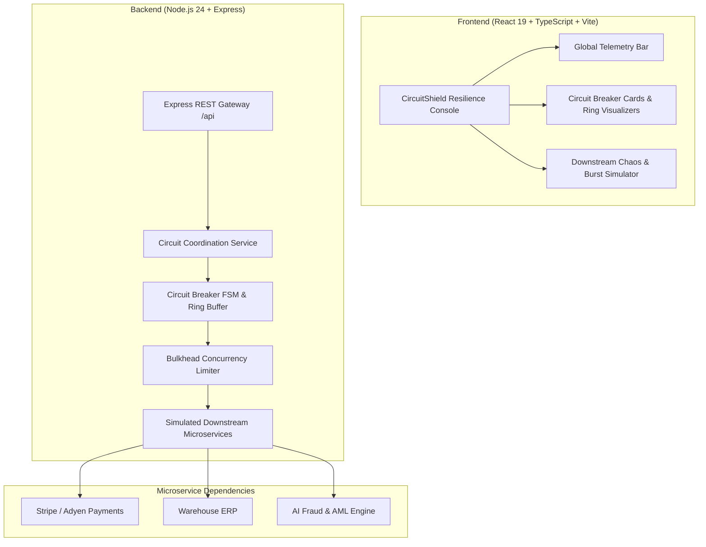

# CircuitShield 🛡️⚡
> **Distributed Circuit Breaker Gateway, Bulkhead Isolation & Adaptive Fault Tolerance Engine**  
> *Engineered for Sub-Millisecond Fail-Fast (<0.1ms), Sliding-Window Ring Buffers, Concurrency Quotas & Autonomous Self-Healing*

[](#)
[](#)
[](#)
[](#)
[](#)
[](#)

---

## ⚡ 2-Minute Overview
**CircuitShield** is an enterprise-grade resilience gateway and fault-tolerance proxy implementing the **Circuit Breaker** (Netflix Hystrix, Resilience4j, and Martin Fowler specifications) and **Bulkhead Isolation** patterns. It protects distributed microservices from cascading failures by monitoring downstream health, tripping open to fail fast when error or latency thresholds are breached, isolating concurrency with bulkheads, and autonomously self-healing via trial probes.

### Core Capabilities
1. **Three-State Finite State Machine (`CLOSED` &rarr; `OPEN` &rarr; `HALF_OPEN`)**: Strict FSM enforcing normal operations in `CLOSED`, sub-millisecond fast-fails ($<0.1\text{ms}$) in `OPEN`, and cautious trial probing in `HALF_OPEN`.
2. **Sliding-Window Ring Buffer**: Analyzes rolling call outcomes over the last $N$ requests (default 20 calls), computing both failure rate % and slow call rate % with a minimum call volume guard.
3. **Bulkhead Concurrency Isolation**: Enforces strict execution concurrency limits per downstream route with bounded waiting queues, isolating failures so slow routes cannot starve healthy endpoints.
4. **Graceful Fallback Degradation**: When circuits trip open or bulkheads saturate, CircuitShield returns rich degraded payloads (e.g. offline queuing, stale cache snapshots) keeping user workflows intact.
5. **Interactive Chaos & Burst Traffic Sandbox**: Engineer dashboard allowing real-time injection of latency and error rates, paired with a concurrent burst generator to watch the circuit trip, fail fast, and self-heal.
6. **Zero External Runtime Dependencies**: Pure TypeScript & Node.js 24 architecture running out of the box with zero external infrastructure requirements.

---

## 🏛️ System Architecture



---

## 🔄 Finite State Machine (FSM) Lifecycle

```
        ┌─────────────────────────────────────────────────────────┐
        │                                                         │
        ▼                                                         │
   [ CLOSED ] ────────(Failure Rate >= 50%)─────────> [ OPEN ]    │
        ▲                                                │        │
        │                                         (Reset Timeout) │
        │                                                │        │
        │                                                ▼        │
        └───────(All Trial Probes OK)─────────── [ HALF-OPEN ] ───┘
                                                       │
                                            (Any Probe Fails)
```

---

## 🛠️ Tech Stack & Engineering Standards

| Layer | Technology | Rationale |
|---|---|---|
| **Runtime** | Node.js 24 (ES Modules) | High-performance asynchronous runtime with native timers and async context |
| **Language** | TypeScript 5.8 (Strict Mode) | Full-stack end-to-end type contracts across FSM states, metrics, and API |
| **Backend Framework** | Express 4.21 | Clean REST architecture with modular controllers and routers |
| **Frontend** | React 19 + Vite 6 | Modern component hierarchy with fast HMR and sub-second builds |
| **Styling** | Modern CSS Variables & Design Tokens | Dark-mode terminal-inspired theme with responsive mobile/desktop layouts |
| **Testing** | Vitest 3.0 + React Testing Library | Unit tests for FSM transitions, sliding-window math, and API integration |
| **Containerization** | Docker Multi-Stage + Compose | Production alpine container with unprivileged non-root runner |
| **Architecture** | ADRs (`docs/adr/`) | Recorded decisions on FSM states, ring buffers, and bulkhead quotas |

---

## 🔌 REST API Reference

| Method | Endpoint | Description |
|---|---|---|
| `GET` | `/api/health` | Gateway health, circuits count, and open circuit count |
| `GET` | `/api/stats` | Telemetry: total calls, passed, fast-fails, bulkhead rejections, fallbacks |
| `GET` | `/api/circuits` | List all monitored circuit breakers with metrics and sliding window |
| `GET` | `/api/circuits/:id` | Detailed state and config for specific circuit |
| `POST` | `/api/circuits/:id/execute` | Execute a protected call through circuit and bulkhead |
| `POST` | `/api/circuits/:id/reset` | Force reset circuit state to `CLOSED` |
| `POST` | `/api/circuits/:id/trip` | Force trip circuit state to `OPEN` |
| `POST` | `/api/circuits/:id/config` | Update thresholds (failure rate %, slow call duration ms, reset timeout) |
| `POST` | `/api/circuits/:id/burst-test` | Run burst test with concurrent requests |
| `POST` | `/api/services/:id/chaos` | Adjust downstream service simulated latency (ms) and error rate (%) |

---

## 💻 Quickstart Guide (Zero-Config)

### Prerequisites
- Node.js 22+ (tested on Node.js 24)
- npm 10+

### 1. Installation
```bash
git clone https://github.com/Taan1el/circuitshield.git
cd circuitshield
npm install
```

### 2. Run Development Environment
```bash
# Concurrently starts backend API (port 4004) and Vite frontend (port 5173)
npm run dev
```
Open **http://localhost:5173** to view the live CircuitShield operations console.

### 3. Run Automated Tests & Quality Checks
```bash
# Run backend FSM, sliding-window and API integration tests
npm run test:server

# Run frontend UI component tests
npm run test:client

# Run full test suite across workspace
npm test

# Typecheck and lint
npm run lint

# Production build verification
npm run build
```

---

## 🐳 Docker Deployment

Run the containerized gateway with Docker Compose:
```bash
docker compose up --build
```
CircuitShield will be accessible at **http://localhost:4004**.

---

## 📜 Architecture Decision Records (ADRs)

Key architectural decisions are documented under [`docs/adr/`](./docs/adr/):
- [ADR-001: Finite State Machine Circuit Breaker Pattern](./docs/adr/001-finite-state-machine-circuit-breaker-pattern.md)
- [ADR-002: Sliding-Window Ring Buffer for Failure & Slow-Call Metrics](./docs/adr/002-sliding-window-ring-buffer-failure-metrics.md)
- [ADR-003: Bulkhead Concurrency Isolation and Graceful Fallbacks](./docs/adr/003-bulkhead-concurrency-isolation-and-graceful-fallbacks.md)

---

## 📄 License
MIT License. Built for technical demonstration and high-scale production architectures.